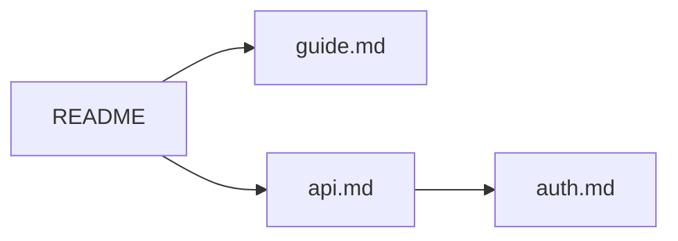

# Markdownz

A fast, lightweight **viewer** for Markdown and PDF documents on Windows, macOS and Linux.
Double-click a `.md` or `.pdf` file, read it, press <kbd>Esc</kbd>, done.

- **Instant start.** Uses the system web view instead of bundling a browser, so installers are only a few MB.
- **Rich rendering.** GitHub-flavored Markdown plus Mermaid, KaTeX math, Graphviz, syntax highlighting, alerts, footnotes, emoji and front matter. Each extra is a plugin you can switch off.
- **PDF too.** PDFs open in the same tabs and history, with text selection, links, outline and find. Document formats are plugins, so more can follow.
- **Printing that thinks ahead.** 1, 2 or 4 pages per sheet, booklets, two-sided printing on any printer (also manually in two passes), with a preview.
- **A viewer, not an editor.** Editing and advanced tools are one step away: **Open with…** hands the document to another application.
- **Tabs that come back.** Open documents are restored with their scroll position and history the next time you start the app.
- **Tree-shaped history.** Going back and following another link does not throw the old path away. **Forward** asks which branch to take, and <kbd>Ctrl</kbd>+<kbd>H</kbd> shows the whole tree.
- **Live reload.** Save the file in your editor and the view updates without losing your place.
- **Safe by default.** Scripts and event handlers in raw HTML are stripped, JavaScript in PDFs is not run, and nothing is downloaded at runtime. Links to local files Markdownz cannot show are only revealed in the file manager, never executed.

## Features

| Area | What you get |
|---|---|
| Formats | Markdown and PDF, each a format plugin that can be switched off in Settings |
| Markdown | CommonMark + GFM tables, task lists, strikethrough, autolinks, raw HTML (sanitized), GitHub-compatible heading anchors |
| Plugins | GitHub alerts (`> [!NOTE]`), footnotes, emoji shortcodes, front matter table, syntax highlighting, KaTeX math (`$…$`, `$$…$$`, fenced ```` ```math ````), Mermaid, Graphviz (```` ```dot ````) |
| PDF | [pdf.js](https://mozilla.github.io/pdf.js/): pages rendered on demand, text selection, internal and external links, outline in the table of contents, find, zoom that re-renders sharply, `#page=N` links from Markdown, printing |
| Navigation | Relative links to other `.md` and `.pdf` files open in the same tab; <kbd>Ctrl</kbd>+click or middle click opens a new tab; `#anchors` work across files |
| Viewing | Zoom (<kbd>Ctrl</kbd>+wheel, <kbd>Ctrl</kbd>+<kbd>+</kbd>/<kbd>-</kbd>/<kbd>0</kbd>), table of contents sidebar, find in page, click a diagram to enlarge with pan and zoom, light/dark theme following the system, print or save as PDF |
| Printing | Own print dialog with preview (<kbd>Ctrl</kbd>+<kbd>P</kbd> or ⎙): 1/2/4 pages per sheet, orientation by page or fixed, scale, alignment, margins, page frames, booklet (pages reordered for folding), two-sided via the printer or manually in two passes, page ranges, A4/Letter; paper is always light, Markdown is paginated between blocks |
| Recent documents | Listed on the start page and in the **+** menu with the time they were last viewed; up to 100 entries, scrollable; when a clicked document no longer exists, Markdownz says so and checks only the entries visible in that list at the moment and shows missing ones as *deleted* (struck through); they stay in the list and open again if the file comes back. The folder icon next to each entry shows the file in Explorer / the default file manager |
| Open with | Menu (<kbd>Ctrl</kbd>+<kbd>Shift</kbd>+<kbd>O</kbd>, the ↗ button or right click on a tab): the system "choose an application" dialog, your own applications from `config.json`, show in folder, copy path |
| Integration | `.md` and `.pdf` file associations, single instance (opening another file adds a tab), drag and drop, command line `markdownz file.md …` |

Try [`samples/demo.md`](samples/demo.md) for a tour of everything.

## Keyboard shortcuts

On macOS use <kbd>⌘</kbd> instead of <kbd>Ctrl</kbd>. Press <kbd>F1</kbd> in the app for this list.

| Keys | Action |
|---|---|
| <kbd>Esc</kbd> | Close the open dialog, find bar or diagram, otherwise close the window |
| <kbd>Ctrl</kbd>+<kbd>O</kbd> | Open file(s) |
| <kbd>Ctrl</kbd>+<kbd>W</kbd>, middle click on tab | Close tab |
| <kbd>Ctrl</kbd>+<kbd>Shift</kbd>+<kbd>T</kbd> | Reopen closed tab |
| Right click on a tab | Close others, tabs to the right / left, all |
| Drag a tab | Reorder tabs |
| <kbd>Ctrl</kbd>+<kbd>Tab</kbd> / <kbd>Ctrl</kbd>+<kbd>Shift</kbd>+<kbd>Tab</kbd>, <kbd>Ctrl</kbd>+<kbd>1</kbd>…<kbd>9</kbd> | Switch tabs |
| <kbd>Alt</kbd>+<kbd>←</kbd>, mouse back | Back |
| <kbd>Alt</kbd>+<kbd>→</kbd>, mouse forward | Forward (asks when there are several branches) |
| <kbd>Ctrl</kbd>+<kbd>H</kbd> | History tree of the current tab |
| <kbd>Ctrl</kbd>+<kbd>F</kbd>, <kbd>F3</kbd>, <kbd>Shift</kbd>+<kbd>F3</kbd> | Find, next, previous |
| <kbd>Ctrl</kbd>+<kbd>B</kbd> | Toggle table of contents |
| <kbd>Ctrl</kbd>+wheel, <kbd>Ctrl</kbd>+<kbd>+</kbd> / <kbd>-</kbd> / <kbd>0</kbd> | Zoom |
| <kbd>F5</kbd>, <kbd>Ctrl</kbd>+<kbd>R</kbd> | Reload |
| <kbd>Ctrl</kbd>+<kbd>Shift</kbd>+<kbd>O</kbd> | Open with another application |
| <kbd>Ctrl</kbd>+<kbd>P</kbd> | Print (pages per sheet, booklet, two-sided, range) |
| <kbd>Ctrl</kbd>+<kbd>,</kbd> | Settings (theme, formats, Markdown extensions) |

## Printing

<kbd>Ctrl</kbd>+<kbd>P</kbd> or the ⎙ button opens Markdownz's print dialog with a live preview of every sheet. Markdownz lays out the sheets itself and then hands them to the system print dialog, so the result is the same on every platform:

| Option | What happens |
|---|---|
| 1 / 2 / 4 pages per sheet | Pages are scaled onto portrait (1, 4) or landscape (2) sheets |
| Booklet | Pages are reordered and placed two per landscape sheet; print two-sided, fold the stack in the middle |
| Orientation | *Auto (by page)* follows the pages: a landscape page gets a landscape sheet, two landscape pages are stacked on a portrait sheet. This also applies to two-sided printing (the flip edge follows the dominant orientation). *Portrait* / *Landscape* force it (Markdown is re-paginated for the wider landscape line) |
| Two-sided (printer) | Choose *Print on both sides* in the system dialog; the hint says which edge to flip on (long for portrait sheets, short for landscape ones) |
| Two-sided, manually | For printers without duplex: front sides first, then Markdownz tells you how to put the stack back and prints the back sides; *reverse order* helps with printers that stack differently |
| Pages | `1-3, 5, 8-`; empty means all |
| Reset | Back to the defaults: 1 page per sheet, orientation and scale automatic, two-sided on the long edge, no margins, no frames |
| Placement | Scale: fit, % of the real page size, or a target page width or height in mm; horizontal and vertical alignment, margins of the physical sheet in mm (optionally also at the fold, so an A4 sheet with two pages acts as two A5 sheets), optional frames around each page and along the sheet margins |

Markdown documents are split into pages between paragraphs, list items, table rows and code lines, never right after a heading. PDF pages are rendered at print resolution. The job sent to the printer always uses portrait paper and landscape sheets are rotated onto it, so portrait and landscape sheets can be mixed on every platform. In the system dialog keep the scale at 100 % / default.

## How the history tree works

Each tab keeps a tree of visited documents instead of a linear back/forward stack:



Say you open `guide.md` from `README`, go back, then open `api.md`. A normal browser would forget `guide.md`; Markdownz keeps both branches.
Pressing **Forward** on `README` offers a choice (the last visited branch is preselected, <kbd>1</kbd>…<kbd>9</kbd> picks directly), and the forward button in the toolbar shows the number of branches.
<kbd>Ctrl</kbd>+<kbd>H</kbd> shows the whole tree, and you can jump to any node.

## Install

Download the installer for your platform from [Releases](https://github.com/drzdez/markdownz/releases):

| OS | Package |
|---|---|
| Windows 10/11 | `.msi` or `-setup.exe` (uses the preinstalled WebView2 runtime) |
| macOS 11+ | `.dmg` (Apple Silicon and Intel builds) |
| Linux | `.flatpak`, `.deb`, `.rpm` or `.AppImage` (the non-Flatpak packages need WebKitGTK 4.1) |

Flatpak: `flatpak install --user ./Markdownz_<version>_x86_64.flatpak` (needs the Flathub remote for the GNOME runtime; see [flatpak/README.md](flatpak/README.md), which also describes publishing on Flathub). Fedora Silverblue, Kinoite and Bazzite should prefer the Flatpak; Fedora Workstation can use the `.rpm` too.

The installers register Markdownz for Markdown files (`.md`, `.markdown`, …) and PDF. Operating systems do not let an installer take over a file type silently, so confirm it once:

| OS | Make Markdownz the default for `.md` and `.pdf` |
|---|---|
| Windows | Right click a file → *Open with* → *Choose another app* → Markdownz → *Always*, or *Settings → Apps → Default apps → Markdownz* |
| macOS | *Get Info* on a file → *Open with: Markdownz* → *Change All…* |
| Linux (deb/rpm) | `xdg-mime default Markdownz.desktop text/markdown application/pdf` |
| Linux (Flatpak) | `xdg-mime default io.github.drzdez.markdownz.desktop text/markdown application/pdf`, or the file manager's *Open With* dialog |

### Open with other applications

**Open with…** shows the system chooser on Windows and Linux (via xdg-desktop-portal, also inside Flatpak) and an application picker on macOS. Frequently used applications can be added to the menu in `config.json` (location below):

```json
{
  "openWith": [
    { "name": "VS Code", "program": "code", "extensions": ["md"] },
    { "name": "Okular", "program": "okular", "args": ["{file}"], "extensions": ["pdf"] }
  ]
}
```

`{file}` is replaced by the document path (appended when missing); `extensions` limits the entry to some formats. On macOS use `"program": "open", "args": ["-a", "Visual Studio Code", "{file}"]`.

> [!NOTE]
> The builds are not code-signed yet. Windows SmartScreen may warn on first run ("More info → Run anyway"). On macOS, right-click the app and choose Open the first time.

## Build from source

Prerequisites ([details](https://v2.tauri.app/start/prerequisites/)):

- [Node.js](https://nodejs.org) 20+ and [Rust](https://rustup.rs) (stable)
- **Windows:** Visual Studio Build Tools with the *Desktop development with C++* workload
- **macOS:** Xcode Command Line Tools
- **Linux (Debian/Ubuntu):** `sudo apt install libwebkit2gtk-4.1-dev libappindicator3-dev librsvg2-dev patchelf build-essential`

```sh
npm install
npm run tauri dev -- -- -- "$PWD/samples/demo.md"   # hot reload; the file needs an absolute path
npm run tauri build                       # installers in src-tauri/target/release/bundle/
```

Other scripts:

| Command | Purpose |
|---|---|
| `npm test` | Unit tests (paths, links, history tree, tab operations, print imposition and pagination) |
| `npm run typecheck` | TypeScript check |
| `npm run dev` | Frontend only, in a normal browser: <http://localhost:1420/?file=/samples/demo.md> |
| `cargo test` (in `src-tauri`) | Rust tests |

Releases are built by GitHub Actions: push a tag such as `v0.1.0`, and [`release.yml`](.github/workflows/release.yml) builds all platforms into a draft release. Bump `version` in `package.json` first; the app reads its version from there.

## Architecture

```
src/                     frontend (TypeScript, Vite)
  app.ts                 tabs, navigation, shortcuts, session
  formats/               document format plugins: markdown.ts, pdf.ts (+ lazy pdfEngine.ts), registry.ts
  history.ts             tree-shaped history (pure, unit tested)
  links.ts, paths.ts     link classification and path resolution
  backend.ts             calls into Rust; plain-browser fallback for development
  render/renderer.ts     Markdown: markdown-it pipeline, extension registry, sanitizing
  render/plugins/        Markdown extensions (alerts, math, Mermaid, Graphviz, …)
  print/                 imposition (pages → sheets, booklet), Markdown pagination, sheet DOM
  ui/                    dialogs (incl. print dialog), find bar, TOC, diagram viewer, theme
src-tauri/               native shell (Rust, Tauri 2)
  src/lib.rs             file reading/watching, state files, single instance, file-open events, open with
  tauri.conf.json        window, security policy (CSP), bundling, file associations
  capabilities/          what the web view is allowed to call
```

Rendering pipeline: `markdown-it` + enabled plugins → HTML → [DOMPurify](https://github.com/cure53/DOMPurify) → DOM → plugin `postRender` hooks (Mermaid and Graphviz turn placeholders into SVG) → shown.
Heavy libraries (Mermaid, Viz.js, pdf.js) load only when a document needs them. pdf.js data files (CMaps, fonts, decoders) are copied to `public/pdfjs` by `scripts/copy-pdfjs.mjs` before `dev` and `build`.

State lives in the OS config directory (`%APPDATA%\io.github.drzdez.markdownz` on Windows, `~/Library/Application Support/io.github.drzdez.markdownz` on macOS, `~/.config/io.github.drzdez.markdownz` on Linux): `session.json` (tabs, history, zoom) and `config.json` (theme, formats, Markdown extensions, open-with applications).

### Adding a document format

A format plugin implements `FormatPlugin` ([`src/formats/types.ts`](src/formats/types.ts)) and is registered in `FORMATS` in [`src/formats/registry.ts`](src/formats/registry.ts). It claims file extensions and creates a `DocumentView` per open document; the app provides tabs, history, session, file watching, the find bar, the table of contents (from `outline()`), zoom and printing around it.

```ts
export const asciidocFormat: FormatPlugin = {
  id: "asciidoc",
  name: "AsciiDoc",
  description: ".adoc documents",
  extensions: ["adoc", "asciidoc"],
  defaultEnabled: true,
  createView: (host) => new AsciidocView(host), // load(), refresh(), setZoom(), outline(), find, ...
};
```

Also add the extensions to `fileAssociations` in `tauri.conf.json` and to `MimeType` in the Flatpak `.desktop` file.

### Writing a Markdown extension

A Markdown extension is an object implementing `ViewerPlugin` ([`src/render/types.ts`](src/render/types.ts)); register it in `PLUGINS` in [`src/render/renderer.ts`](src/render/renderer.ts). It appears in Settings automatically.

```ts
export const plantumlPlugin: ViewerPlugin = {
  id: "plantuml",
  name: "PlantUML",
  description: "```plantuml blocks",
  defaultEnabled: true,
  setup: (md) => { /* optional: md.use(someMarkdownItPlugin) */ },
  fences: { plantuml: (code) => diagramSource("plantuml", code) },
  async postRender(root, ctx) { /* replace placeholders with rendered SVG */ },
};
```

## Roadmap

- PlantUML (needs Java or a server, so it would stay opt-in)
- Code signing for Windows and macOS
- More formats as plugins (images, AsciiDoc, …)
- Editing stays out of scope: use **Open with…**

## License

[MIT](LICENSE)
