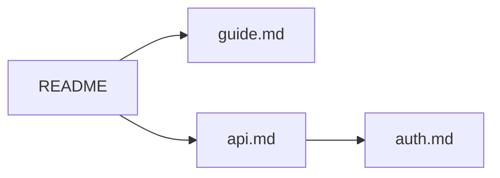

# Markdownz

A fast, lightweight Markdown **viewer** for Windows, macOS and Linux.
Double-click a `.md` file, read it, press <kbd>Esc</kbd>, done.

- **Instant start.** Uses the system web view instead of bundling a browser, so installers are only a few MB.
- **Rich rendering.** GitHub-flavored Markdown plus Mermaid, KaTeX math, Graphviz, syntax highlighting, alerts, footnotes, emoji and front matter. Each extra is a plugin you can switch off.
- **Tabs that come back.** Open documents are restored with their scroll position and history the next time you start the app.
- **Tree-shaped history.** Going back and following another link does not throw the old path away. **Forward** asks which branch to take, and <kbd>Ctrl</kbd>+<kbd>H</kbd> shows the whole tree.
- **Live reload.** Save the file in your editor and the view updates without losing your place.
- **Safe by default.** Scripts and event handlers in raw HTML are stripped, and nothing is downloaded at runtime. Links to local non-Markdown files are only revealed in the file manager, never executed.

## Features

| Area | What you get |
|---|---|
| Markdown | CommonMark + GFM tables, task lists, strikethrough, autolinks, raw HTML (sanitized), GitHub-compatible heading anchors |
| Plugins | GitHub alerts (`> [!NOTE]`), footnotes, emoji shortcodes, front matter table, syntax highlighting, KaTeX math (`$…$`, `$$…$$`, fenced ```` ```math ````), Mermaid, Graphviz (```` ```dot ````) |
| Navigation | Relative links to other `.md` files open in the same tab; <kbd>Ctrl</kbd>+click or middle click opens a new tab; `#anchors` work across files |
| Viewing | Zoom (<kbd>Ctrl</kbd>+wheel, <kbd>Ctrl</kbd>+<kbd>+</kbd>/<kbd>-</kbd>/<kbd>0</kbd>), table of contents sidebar, find in page, click a diagram to enlarge with pan and zoom, light/dark theme following the system, print or save as PDF |
| Integration | `.md` file association, single instance (opening another file adds a tab), drag and drop, command line `markdownz file.md …` |

Try [`samples/demo.md`](samples/demo.md) for a tour of everything.

## Keyboard shortcuts

On macOS use <kbd>⌘</kbd> instead of <kbd>Ctrl</kbd>. Press <kbd>F1</kbd> in the app for this list.

| Keys | Action |
|---|---|
| <kbd>Esc</kbd> | Close the open dialog, find bar or diagram, otherwise close the window |
| <kbd>Ctrl</kbd>+<kbd>O</kbd> | Open file(s) |
| <kbd>Ctrl</kbd>+<kbd>W</kbd>, middle click on tab | Close tab |
| <kbd>Ctrl</kbd>+<kbd>Shift</kbd>+<kbd>T</kbd> | Reopen closed tab |
| Right click on a tab | Close others, tabs to the right / left, all |
| Drag a tab | Reorder tabs |
| <kbd>Ctrl</kbd>+<kbd>Tab</kbd> / <kbd>Ctrl</kbd>+<kbd>Shift</kbd>+<kbd>Tab</kbd>, <kbd>Ctrl</kbd>+<kbd>1</kbd>…<kbd>9</kbd> | Switch tabs |
| <kbd>Alt</kbd>+<kbd>←</kbd>, mouse back | Back |
| <kbd>Alt</kbd>+<kbd>→</kbd>, mouse forward | Forward (asks when there are several branches) |
| <kbd>Ctrl</kbd>+<kbd>H</kbd> | History tree of the current tab |
| <kbd>Ctrl</kbd>+<kbd>F</kbd>, <kbd>F3</kbd>, <kbd>Shift</kbd>+<kbd>F3</kbd> | Find, next, previous |
| <kbd>Ctrl</kbd>+<kbd>B</kbd> | Toggle table of contents |
| <kbd>Ctrl</kbd>+wheel, <kbd>Ctrl</kbd>+<kbd>+</kbd> / <kbd>-</kbd> / <kbd>0</kbd> | Zoom |
| <kbd>F5</kbd>, <kbd>Ctrl</kbd>+<kbd>R</kbd> | Reload |
| <kbd>Ctrl</kbd>+<kbd>P</kbd> | Print / save as PDF |
| <kbd>Ctrl</kbd>+<kbd>,</kbd> | Settings (theme, plugins) |

## How the history tree works

Each tab keeps a tree of visited documents instead of a linear back/forward stack:



Say you open `guide.md` from `README`, go back, then open `api.md`. A normal browser would forget `guide.md`; Markdownz keeps both branches.
Pressing **Forward** on `README` offers a choice (the last visited branch is preselected, <kbd>1</kbd>…<kbd>9</kbd> picks directly), and the forward button in the toolbar shows the number of branches.
<kbd>Ctrl</kbd>+<kbd>H</kbd> shows the whole tree, and you can jump to any node.

## Install

Download the installer for your platform from [Releases](https://github.com/drzdez/markdownz/releases):

| OS | Package |
|---|---|
| Windows 10/11 | `.msi` or `-setup.exe` (uses the preinstalled WebView2 runtime) |
| macOS 11+ | `.dmg` (Apple Silicon and Intel builds) |
| Linux | `.flatpak`, `.deb`, `.rpm` or `.AppImage` (the non-Flatpak packages need WebKitGTK 4.1) |

Flatpak: `flatpak install --user ./Markdownz_<version>_x86_64.flatpak` (needs the Flathub remote for the GNOME runtime; see [flatpak/README.md](flatpak/README.md), which also describes publishing on Flathub). Fedora Silverblue, Kinoite and Bazzite should prefer the Flatpak; Fedora Workstation can use the `.rpm` too.

The installers register Markdownz as a viewer for `.md`, `.markdown` and similar extensions. To make it the default app, use "Open with → Always" (Windows/macOS) or `xdg-mime default markdownz.desktop text/markdown` (Linux).

> [!NOTE]
> The builds are not code-signed yet. Windows SmartScreen may warn on first run ("More info → Run anyway"). On macOS, right-click the app and choose Open the first time.

## Build from source

Prerequisites ([details](https://v2.tauri.app/start/prerequisites/)):

- [Node.js](https://nodejs.org) 20+ and [Rust](https://rustup.rs) (stable)
- **Windows:** Visual Studio Build Tools with the *Desktop development with C++* workload
- **macOS:** Xcode Command Line Tools
- **Linux (Debian/Ubuntu):** `sudo apt install libwebkit2gtk-4.1-dev libappindicator3-dev librsvg2-dev patchelf build-essential`

```sh
npm install
npm run tauri dev -- -- -- "$PWD/samples/demo.md"   # hot reload; the file needs an absolute path
npm run tauri build                       # installers in src-tauri/target/release/bundle/
```

Other scripts:

| Command | Purpose |
|---|---|
| `npm test` | Unit tests (paths, links, history tree) |
| `npm run typecheck` | TypeScript check |
| `npm run dev` | Frontend only, in a normal browser: <http://localhost:1420/?file=/samples/demo.md> |
| `cargo test` (in `src-tauri`) | Rust tests |

Releases are built by GitHub Actions: push a tag such as `v0.1.0`, and [`release.yml`](.github/workflows/release.yml) builds all platforms into a draft release. Bump `version` in `package.json` first; the app reads its version from there.

## Architecture

```
src/                     frontend (TypeScript, Vite)
  app.ts                 tabs, navigation, shortcuts, session
  history.ts             tree-shaped history (pure, unit tested)
  links.ts, paths.ts     link classification and path resolution
  backend.ts             calls into Rust; plain-browser fallback for development
  render/renderer.ts     markdown-it pipeline, plugin registry, sanitizing
  render/plugins/        built-in plugins
  ui/                    dialogs, find bar, TOC, diagram viewer, theme
src-tauri/               native shell (Rust, Tauri 2)
  src/lib.rs             file reading/watching, state files, single instance, file-open events
  tauri.conf.json        window, security policy (CSP), bundling, file associations
  capabilities/          what the web view is allowed to call
```

Rendering pipeline: `markdown-it` + enabled plugins → HTML → [DOMPurify](https://github.com/cure53/DOMPurify) → DOM → plugin `postRender` hooks (Mermaid and Graphviz turn placeholders into SVG) → shown.
Heavy libraries (Mermaid, Viz.js) load only when a document actually contains a diagram.

State lives in the OS config directory (`%APPDATA%\io.github.drzdez.markdownz` on Windows, `~/Library/Application Support/io.github.drzdez.markdownz` on macOS, `~/.config/io.github.drzdez.markdownz` on Linux): `session.json` (tabs, history, zoom) and `config.json` (theme, plugins).

### Writing a plugin

A plugin is an object implementing `ViewerPlugin` ([`src/render/types.ts`](src/render/types.ts)); register it in `PLUGINS` in [`src/render/renderer.ts`](src/render/renderer.ts). It appears in Settings automatically.

```ts
export const plantumlPlugin: ViewerPlugin = {
  id: "plantuml",
  name: "PlantUML",
  description: "```plantuml blocks",
  defaultEnabled: true,
  setup: (md) => { /* optional: md.use(someMarkdownItPlugin) */ },
  fences: { plantuml: (code) => diagramSource("plantuml", code) },
  async postRender(root, ctx) { /* replace placeholders with rendered SVG */ },
};
```

## Roadmap

- PlantUML (needs Java or a server, so it would stay opt-in)
- Code signing for Windows and macOS
- Editing (not planned for now, Markdownz is a viewer)

## License

[MIT](LICENSE)
