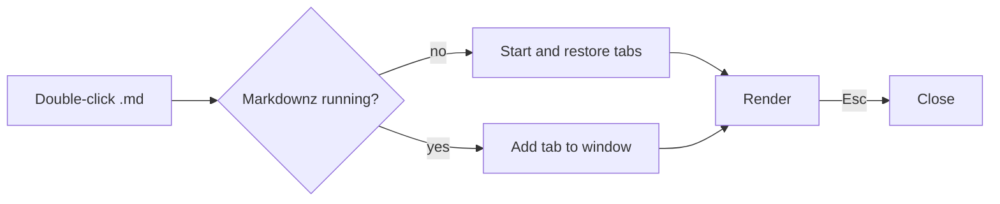
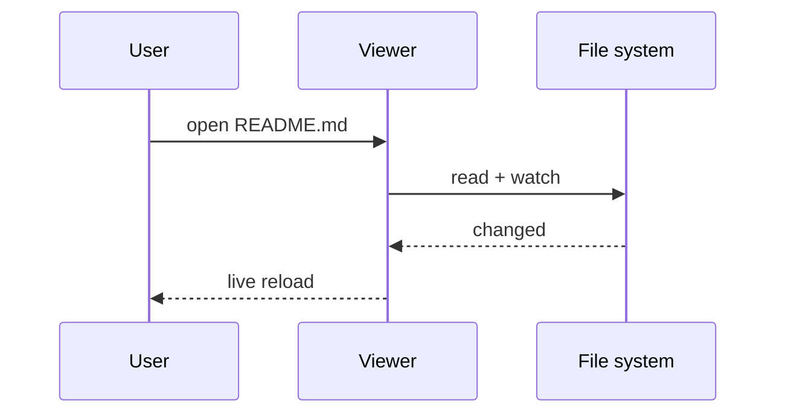
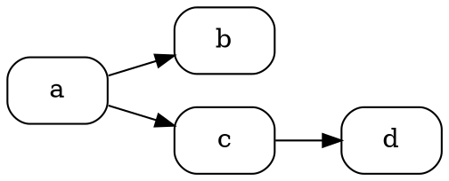

# Markdownz feature tour

A single page that exercises every built-in plugin. Open it with
`npm run tauri dev -- -- -- "$PWD/samples/demo.md"` or double-click it once Markdownz is installed.

- [Linked page A](linked-a.md): try **Back** (Alt+←), then open [page B](linked-b.md),
  go back and press **Forward** (Alt+→): Markdownz asks which branch to follow.
- [Jump to the math section](#math-katex)
- [A heading in another file](linked-a.md#section-two)
- [A PDF, opened on page 2](sample.pdf#page=2): PDFs open in the same tab and history
- External: [mermaid.js.org](https://mermaid.js.org)

## Text and GFM

**Bold**, *italic*, ~~strikethrough~~, `inline code`, autolink https://github.com and emoji :rocket: :tada:.

| Feature | Status | Notes |
|:--|:-:|--:|
| Tables | ✅ | aligned |
| Task lists | ✅ | below |

- [x] Render Markdown
- [x] Mermaid
- [ ] Editing (later)

> [!NOTE]
> GitHub-style alerts work.

> [!WARNING]
> Scripts in raw HTML are removed: <script>alert("nope")</script>

Footnote reference[^1].

[^1]: The footnote text.

<details>
<summary>Raw HTML details block</summary>

Hidden content with **markdown** inside.

</details>

## Code

```ts
export function greet(name: string): string {
  return `Hello, ${name}!`;
}
```

```rust
fn main() {
    println!("Hello from Rust");
}
```

## Math (KaTeX)

Inline $e^{i\pi} + 1 = 0$ and a block:

$$
\int_{-\infty}^{\infty} e^{-x^2}\,dx = \sqrt{\pi}
$$

```math
\begin{pmatrix} a & b \\ c & d \end{pmatrix}
```

## Mermaid





```mermaid
this is not a valid diagram
```

## Graphviz



## Image


